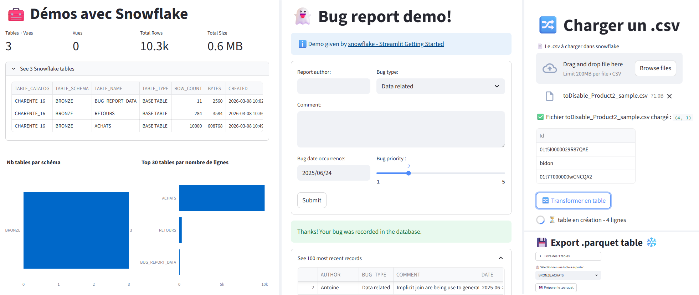
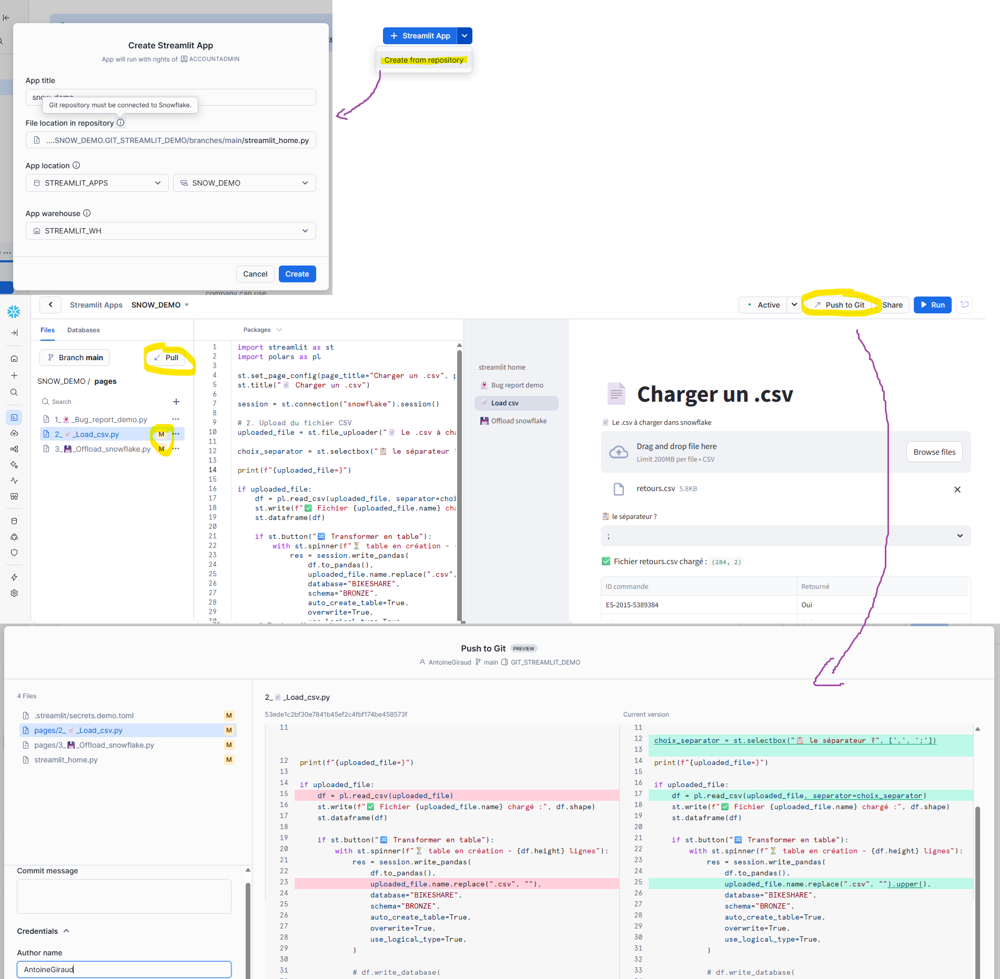

# Démo Streamlit avec Snowflake ❄️

Démos pour apprendre Streamlit avec Snowflake



## Inspirations & ressources

- by [Gaël Penessot](https://github.com/gpenessot)
  - [Streamlit App Template](https://github.com/gpenessot/streamlit-app-template)
- by Snowflake
  - [Streamlit Getting Started demo](https://docs.snowflake.com/en/developer-guide/streamlit/getting-started#build-your-first-sis-app)
  - [Snowflake git setup](https://docs.snowflake.com/en/developer-guide/git/git-setting-up)
- by Streamlit
  - [Create a multi-app page](https://docs.streamlit.io/get-started/tutorials/create-a-multipage-app)
  - [Snowflake connexion](https://docs.streamlit.io/develop/tutorials/databases/snowflake#write-your-streamlit-app)


## Installation & commandes

1. Installer uv 👉 cf. [doc astral/uv](https://docs.astral.sh/uv/getting-started/installation/)
2. Lancer l'app streamlit : `uv run streamlit run home.py`

<details>
<summary>Astuces de développement</summary>

- `uv sync`
  - télécharge **python** <em style="color: grey">si non présent</em>
  - initialise un environnement virtuel python (venv) <em style="color: grey">si non présent</em>
  - télécharge les dépendances / extensions python
- `.venv/Scripts/activate.ps1` (unix `source .venv/bin/activate`)\
  rendre la commande **streamlit** disponible dans le terminal
    - si erreur d'autorisation `PowerShell` :\
    `Set-ExecutionPolicy -ExecutionPolicy RemoteSigned -Scope CurrentUser`
- Activer `prek` (`pre-commit` en rust)\
  pour qq dernières validations avant de commit  (cf. [📹 vulgarisation pre-commit](https://youtu.be/2r4uLr8MdcA) - 5min)
  - `prek install` : initialiser le hook git
  - `prek --all-files` : pour traiter TOUS les fichiers

</details>

### Ajouter sa clé ssh à snowflake

Pour l'utiliser dans votre `.streamlit/secrets.toml` afin de connecter votre app streamlit à snowflake.

<details>
<summary>Etapes pour préparer clé ssh snowflake</summary>


1. **créer une clé ssh** (paire publique/privée)
    ```bash
    cd ~\.ssh
    ssh-keygen -t rsa -b 2048 -m pkcs8 -C "agiraud" -f key_agiraud_snowflake
    ```

2. **afficher la clé publique** au format requis par snowflake
   ```bash
   ssh-keygen -e -m pkcs8 -f key_agiraud_snowflake.pub
   ```

3. Dans snowflake, **ajouter** à notre compte cette clé **publique**
    ```sql
    use role useradmin;
    show users like '%giraud%';
    alter user "agiraud" set rsa_public_key_2='monTokenSans--beginpublickey--';
    ```
</details>

## 💡 Idée: Setup git dans Snowflake


<details>
<summary>🎯 Cible - Avoir une <strong>app streamlit dans snowflake</strong> connectée à votre repo git</summary>



</details>

🚨 Attention : dans l'interface Web, le Warehouse reste actif tant que l'onglet est ouvert.

### 📜 Etapes pour la connexion git dans snowflake ❄️

Inspiré de la [doc snowflake - git-setting-up](https://docs.snowflake.com/fr/developer-guide/git/git-setting-up#configure-for-authenticating-with-a-token)


<details>
<summary>1. Choisir où ranger vos artefacts git</summary>

```sql
-- prepare infra db & schema
use role sysadmin;

create database infra comment = "artefacts techniques. (ex: répo git, log centralisés ...)";
create or replace schema git_repos comment = "Schéma hébergeant notre répo git dbt";
use schema infra.git_repos;
show schemas in database infra;
```

</details>
<details>
<summary>2. Préparer votre <code>Personal Access Token</code> côté hébergeur git</summary>

- Exemple [doc liée](https://docs.github.com/en/authentication/keeping-your-account-and-data-secure/managing-your-personal-access-tokens#creating-a-fine-grained-personal-access-token) côté **Github** 👉 avec qq liens préparés
  - create PAT token [read repo contents](https://github.com/settings/personal-access-tokens/new?name=Repo-reading+token&description=Just+contents:read&contents=read)
  - create PAT token [update code and open a PR](https://github.com/settings/personal-access-tokens/new?name=Core-loop+token&description=Write%20code%20and%20push%20it%20to%20main%21%20Includes%20permission%20to%20edit%20workflow%20files%20for%20Actions%20-%20remove%20%60workflows%3Awrite%60%20if%20you%20don%27t%20need%20to%20do%20that&contents=write&pull_requests=write&workflows=write)
- Exemple côté **BitBucket**
  - `https://bitbucket.org/{team_or_user_name}/{repo}/admin/access-tokens`

</details>
<details>
<summary>3. Créer dans snowflake : secret, api integration</summary>

1. Ranger le **token** dans Snowflake
    ```sql
    -- Côté Github
    create or replace secret git_secret
      type = password
      username = 'TonNomUtilisateurGitHub'
      password = 'TonTokenPersonnel';

    -- Côté BitBucket
    create or replace secret git_secret
      type = password
      username = 'x-token-auth'
      password = 'TonTokenPersonnel';

    -- note: le jour où on "rotate" les credentials,
    -- il faut juste rejouer cette requête et tout suit :)
    ```

2. Créer l’**intégration api** git \
   *permettre à snowflake de parler à votre repo git*
    ```sql
    use role accountadmin;
    create or replace api integration git_integration
      api_provider = git_https_api
      api_allowed_prefixes = ('https://github.com/AntoineGiraud')
      allowed_authentication_secrets = (git_secret)
      enabled = true;
    ```
    résultat: nouvelle entrée dans ⚙️ Admin > Integrations

</details>
<details>
<summary>4. Préparer un role git admin</summary>

cf. [doc snow](https://docs.snowflake.com/fr/developer-guide/git/git-setting-up#create-a-snowflake-git-repository-clone)

```sql
use role securityadmin;

create or replace role git_admin comment = "git admin role (git clone & fetch)";
grant role git_admin to role sysadmin;
grant create git repository on schema infra.git_repos to role git_admin;
grant usage on integration git_integration to role git_admin;
grant read on secret git_secret to role git_admin;
use role git_admin;
```

</details>
<details>
<summary>5. Créer le répo git dans Snowflake</summary>

```sql
-- On fait enfin le git clone !
create or replace git repository git_streamlit_demo
  api_integration = git_integration
  git_credentials = git_secret
  origin = 'https://github.com/AntoineGiraud/streamlit_snowflake_demo.git';
  -- origin = 'https://bitbucket.org/<team_or_user_name>/<repo>.git';

-- Récupérer le contenu du git (git fetch)
alter git repository git_streamlit_demo fetch;

-- Vérification
show git branches in git_streamlit_demo;
ls @git_streamlit_demo/branches/main; -- ou master selon ton repo
```

</details>
