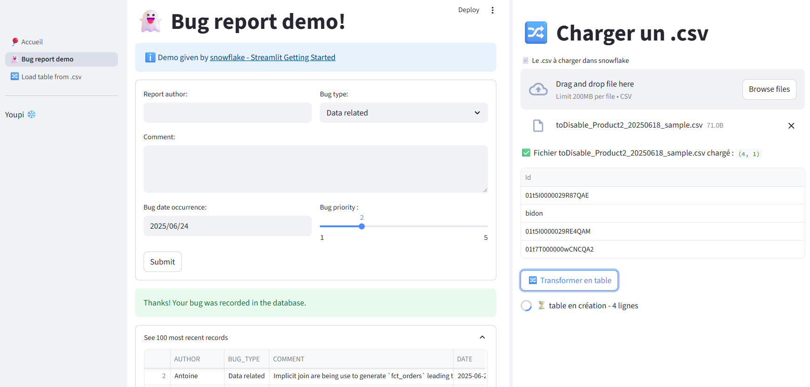

# Streamlit & Snowflake demo

Démos pour apprendre Streamlit avec Snowflake



## Inspirations & ressources

- by [Gaël Penessot](https://github.com/gpenessot)
  - [Streamlit App Template](https://github.com/gpenessot/streamlit-app-template)
- by Snowflake
  - [Streamlit Getting Started demo](https://docs.snowflake.com/en/developer-guide/streamlit/getting-started#build-your-first-sis-app)
  - [Snowflake git setup](https://docs.snowflake.com/en/developer-guide/git/git-setting-up)
- by Streamlit
  - [Create a multi-app page](https://docs.streamlit.io/get-started/tutorials/create-a-multipage-app)
  - [Snowflake connexion](https://docs.streamlit.io/develop/tutorials/databases/snowflake#write-your-streamlit-app)


## Setup git dans snowflake ❄️

0. Choisir où "ranger" le répo git
    ```sql
    use role role_streamlit;
    use warehouse streamlit_wh;
    use schema streamlit_apps.snow_demo;
    ```

1. Préparer un personnal access token dans son hébergeur git
    * ex Github : [doc liée](https://docs.github.com/en/authentication/keeping-your-account-and-data-secure/managing-your-personal-access-tokens#creating-a-fine-grained-personal-access-token) & lien raccourci
      - create PAT token [read repo contents](https://github.com/settings/personal-access-tokens/new?name=Repo-reading+token&description=Just+contents:read&contents=read)
      - create PAT token [update code and open a PR](https://github.com/settings/personal-access-tokens/new?name=Core-loop+token&description=Write%20code%20and%20push%20it%20to%20main%21%20Includes%20permission%20to%20edit%20workflow%20files%20for%20Actions%20-%20remove%20%60workflows%3Awrite%60%20if%20you%20don%27t%20need%20to%20do%20that&contents=write&pull_requests=write&workflows=write)

2. Initialiser le token dans Snowflake
    ```sql
    CREATE OR REPLACE SECRET github_secret
      TYPE = PASSWORD
      USERNAME = 'TonNomUtilisateurGitHub'
      PASSWORD = 'TonTokenPersonnel';
    ```

3. Créer l’intégration API Git :
    ```sql
    CREATE OR REPLACE API INTEGRATION github_integration
      API_PROVIDER = GIT_HTTPS_API
      API_ALLOWED_PREFIXES = ('https://github.com/AntoineGiraud')
      ALLOWED_AUTHENTICATION_SECRETS = (github_secret)
      ENABLED = TRUE;
    ```
    résultat: nouvelle entrée dans ⚙️ Admin > Integrations
    

4. Créer le repository dans Snowflake :
    ```sql
    CREATE OR REPLACE GIT REPOSITORY git_streamlit_demo
      API_INTEGRATION = github_integration
      GIT_CREDENTIALS = github_secret
      ORIGIN = 'https://github.com/AntoineGiraud/streamlit_snowflake_demo.git';
    ```

5. Récupérer le contenu :
    ```sql
    ALTER GIT REPOSITORY git_streamlit_demo FETCH;
    ```

## Connecter une app streamlit snowflake à son répo git


